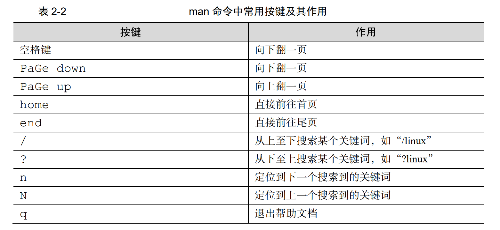
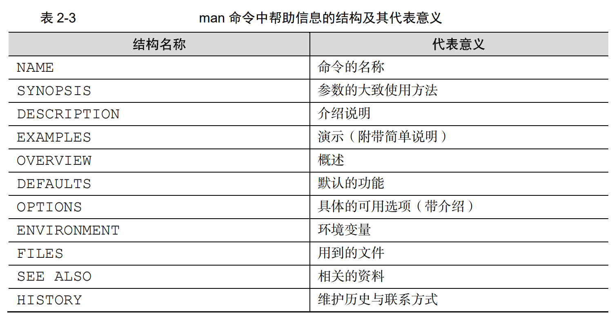
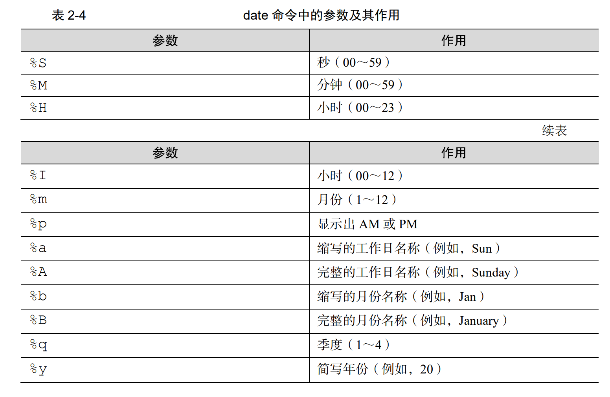
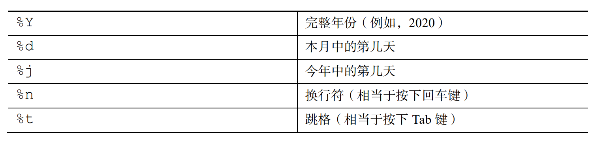
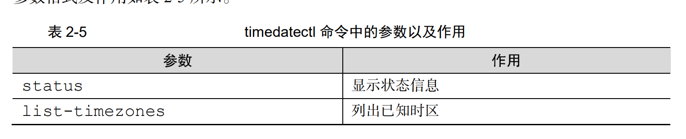
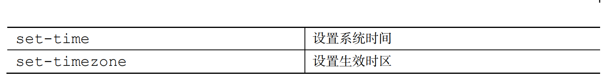
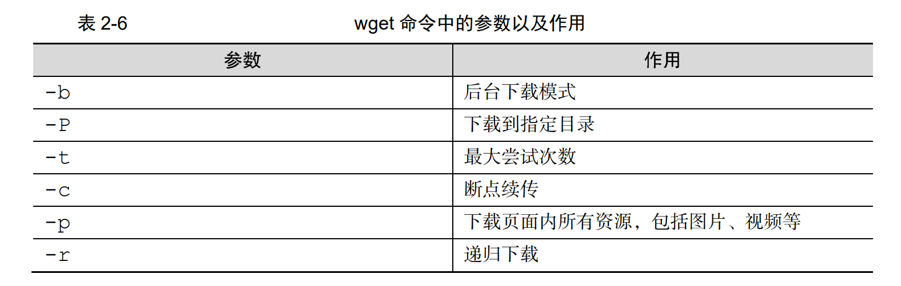
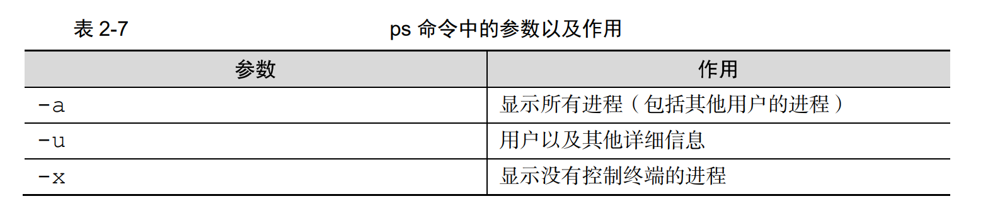
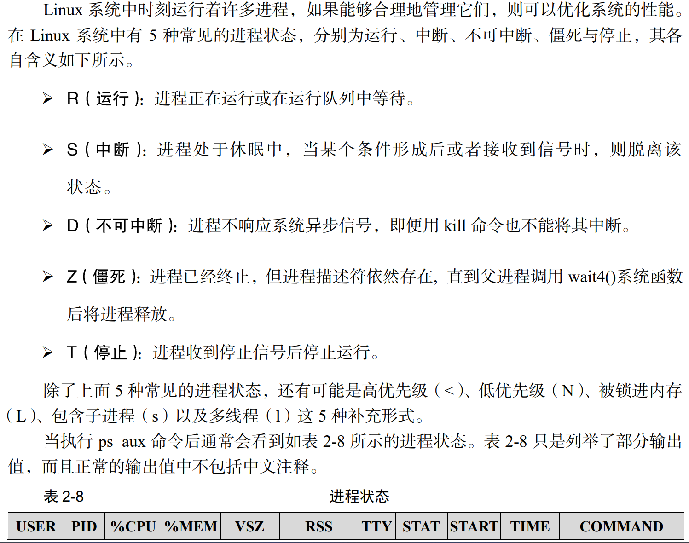
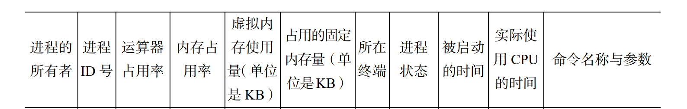

### Linux 命令的格式

```
命令名称   [命令参数]   命令对象
```


### man命令中常见的键位





`#`表示管理员身份 （如果是`$`则表示普通用户，相应的权限也会小一些）

#### 组合键小技巧

-  连按两次`Tab`即可实现补全
- `ctrl + c` 终止进程
- `ctrl + D` 键盘输入结束
- `ctrl  + l `清屏 `<==>` `clear`


## 常用系统工作命令

- `echo` 用于在终端设备上输出字符， 语法格式`echo [字符串] [$变量]`
- `date` 命令用于显示或设置系统的时间与日期，语法格式为`date [+指定的格式]`。 





- `timedatectl`：设置系统时间





- `reboot` 重启电脑
- `poweroff` ：关闭系统
- `wget`： 在终端命令行中下载网络文件，格式：`wget [参数] 网址`



- `ps(process)` : 查看系统中的进程状态，语法格式：`ps [参数]`







- `pstree` 以树状图的形式展现进程之间相互依赖关系
- `top`动态监视进程活动及系统负载信息

➢ 第 1 行：系统时间、运行时间、登录终端数、系统负载（3 个数值分别为 1 分钟、5 分钟、15 分钟内的平均值，数值越小意味着负载越低）。 

➢ 第 2 行：进程总数、运行中的进程数、睡眠中的进程数、停止的进程数、僵死的进程 数。 

➢ 第 3 行：用户占用资源百分比、系统内核占用资源百分比、改变过优先级的进程资源 百分比、空闲的资源百分比等。其中数据均为 CPU 数据并以百分比格式显示，例如 “99.9 id”意味着有 99.9%的 CPU 处理器资源处于空闲。

➢ 第 4 行：物理内存总量、内存空闲量、内存使用量、作为内核缓存的内存量。 

➢ 第 5 行：虚拟内存总量、虚拟内存空闲量、虚拟内存使用量、已被提前加载的内存量。 

- `nice` 用于调整进程的优先级，语法格式`nice 优先级数字 服务名字 `

在 top 命令输出的结果中，PR 和 NI 值代表的是进程的优先级，数字越低（取值范围是 -20～19），优先级越高。 

- `pidof` 查询某个特定服务进程的PID号码，语法格式`pidof [参数] 服务名称`
- `kill` 用来中止某个进程指定的`PID`地址 语法格式`kill [参数] 进程的 PID `
- `killall` 命令用于终止某个指定名称的服务所对应的全部进程，语法格式为`killall [参数] 服 务名称`。 

如果有些命令在执行 时不断地在屏幕上输出信息，影响到后续命令的输入，则可以在执行命令时在末尾添加一个 &符号，这样命令将进入系统后台来执行。 


## 系统状态检测命令

- `ifconfig` 获取网卡配置和网络状态信息 `ifconfig [参数][网络设备]`
- 


